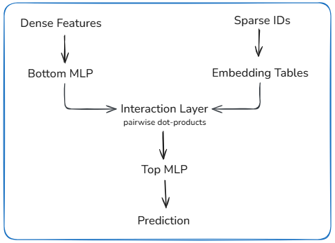

# Deep Learning Recommendation Model (DLRM, 2019)

## Core Idea
DLRM is a recommendation model designed to make large-scale training and serving predictable and efficient on modern hardware.
It prioritizes throughput, memory efficiency, and stable performance over modeling flexibility.  
The architecture is shaped by hardware constraints as much as by learning objectives.

## Model and System Structure

- **Dense Features**
  - Numerical features are passed through a bottom MLP.
  - Output is a dense representation with fixed dimensionality.

- **Sparse Features**
  - High-cardinality categorical features are mapped to embedding tables.
  - Embedding lookups dominate model size and memory access cost.

- **Feature Interaction**
  - Dense outputs and sparse embeddings are combined using fixed dot-product interactions.
  - Interaction structure is predefined and does not adapt during training.

- **Scoring**
  - Interaction outputs are passed to a top MLP to produce the final prediction.
  - Model structure maps cleanly to GPU execution and parallelism.

## Tradeoffs

- Fixed interaction patterns make compute cost predictable, but limit expressive feature combinations.
- Large embedding tables capture sparse signals well, but dominate memory usage and scaling complexity.
- Dot-product interactions are efficient, but cannot model higher-order relationships.
- Hardware-oriented design improves throughput and stability, but does not model temporal or sequential effects.

## Mental Model

Think of DLRM as separating *what is expensive* from *what is flexible*.  
Embeddings handle scale and sparsity, while MLPs handle dense transformation.  
The interaction layer fixes how these parts combine so cost and latency are easy to reason about.

## Takeaway
DLRM trades modeling flexibility for predictable performance at scale.  
It is well suited for systems where throughput, stability, and hardware efficiency matter more than expressive interactions.
