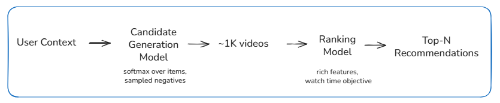

# Deep Neural Networks for YouTube Recommendations (2016)

## Core Ideas
 Formulate recommendation as conditional density estimation over items given user context, approximated via sampled softmax.
- Use expected watch time as the primary optimization signal.
- Treat candidate generation as a recall-driven problem under tight latency and memory budgets.
- Accept approximation at training and serving time as a necessary system constraint.
- Decouple representation learning (retrieval) from feature-rich decision modeling (ranking).

## Model and System Structure

- **Candidate Generation**
  - A neural network maps user context and history to a fixed-dimensional embedding.
  - Items are represented by learned embeddings in the same space.
  - Training uses sampled softmax over a very large item vocabulary.
  - At serving time, a fixed-size candidate set is retrieved under latency constraints.

- **Ranking**
  - A separate deep network scores only the retrieved candidates.
  - Uses richer features and non-linear interactions.
  - Optimizes for expected watch time rather than binary engagement.

Training pipelines, feature sets, and objectives are distinct between retrieval and ranking.

## Tradeoffs

- Cutting the item set early keeps latency low, but any item not retrieved can never be ranked later.

- Sampling during training makes large catalogs manageable, but the model learns from an incomplete view of items.

- Optimizing for a single engagement signal simplifies training and evaluation, but different user intents are folded into one number.

- Separating retrieval from ranking improves scale and iteration speed, but recall errors dominate end-to-end quality.

## Mental Note
Assume a corpus of 10M videos.  
Candidate generation approximates a softmax over this space using ~5K sampled negatives per update.  
At serving time, only the top ~500 candidates by dot-product score are retrieved. Ranking then evaluates these candidates using hundreds of features, where a 1–2% loss in retrieval recall can outweigh double-digit relative improvements in ranking metrics.

## Takeaway
Most recommendation errors are decided before ranking runs.  
Retrieval determines which items are even eligible to be shown, and ranking can only reorder that set.  
This makes recall and sampling behavior more influential than incremental ranking improvements.
