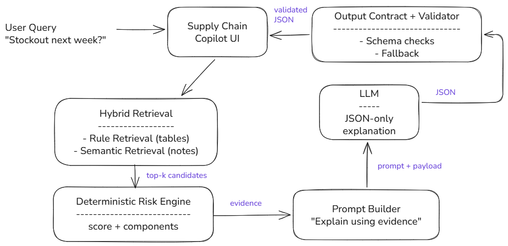

---
title: "Hybrid RAG Supply Chain Copilot (FAISS + Local Llama): deterministic risk, grounded explanations"


# Hybrid RAG Supply Chain Copilot: from a messy question to an auditable answer

A planner asks a simple question:

**Which SKUs are at risk of stockout next week, and why?**

This is not sourced from a single dataset.
Tables carry the operational truth.
Notes carry the reasons people trust.
A useful copilot must combine both, compute a decision deterministically, and explain it with evidence.

This project demonstrates a production-leaning pattern where:

**The system decides. The model explains.**


## What this copilot returns

For each risky SKU, the copilot returns:

- `risk_score` and `risk_level` computed by deterministic code.
- `top_reasons` in plain English.
- `recommended_action` in one sentence.
- `source_evidence` copied from retrieved data and notes.

The output is strict JSON so it can be rendered in a UI and validated.


## Architecture and data flows

### Pipeline

**User Query → Hybrid Retrieval → Deterministic Risk Engine → Prompt Builder → Local LLM → JSON Validation → UI**

### Data flow diagram




## The RAG component

### What “RAG” means here

Retrieval happens before generation.
The generator never sees the full dataset.
It sees only retrieved evidence:

- **Structured evidence** from tables (inventory, shipments, demand, POs).
- **Unstructured evidence** from supplier notes (text snippets).

### Why this is hybrid RAG (not vector-only)

Vector search is good for notes.
It is not enough for tables.

This pattern uses two retrieval channels:

1) **Rule-based retrieval** to rank SKUs from operational signals (thresholds, joins, filters).  
2) **Semantic retrieval** to surface relevant note snippets (meaning-based matching).

Hybrid retrieval keeps structured logic dominant while still recovering human context from text.


## The GenAI component (what the LLM actually does)

The LLM does **not** compute risk.
The LLM does **not** decide the ranking.

The LLM is used only for:

- Turning deterministic risk + evidence into a short explanation.
- Producing **UI-ready JSON** that can be validated.

This keeps business logic stable and makes the model replaceable.


### 1) Synthetic data model

Five tables are generated: inventory, shipments, demand signals, purchase orders, supplier notes.
A combined `features` table is used for retrieval and scoring.

Example feature rows:

| sku_id   |   on_hand_units |   avg_daily_demand |   safety_stock_units |   days_of_cover |   demand_spike_pct |   promo_flag |   max_delay_days |   eta_days |   open_po_units | buyer_priority   |   net_available_7d |   stockout_risk_flag_7d |
|:---------|----------------:|-------------------:|---------------------:|----------------:|-------------------:|------------:|-----------------:|----------:|---------------:|:-----------------|-------------------:|------------------------:|
| SKU-001  |             122 |                 46 |                   69 |             2.7 |                  0 |           1 |                8 |        20 |            510 | normal           |                310 |                       0 |
| SKU-002  |             455 |                 64 |                  123 |             7.1 |                 20 |           0 |                6 |        17 |            751 | normal           |                758 |                       0 |
| SKU-003  |             290 |                 19 |                   21 |            15.3 |                  0 |           0 |               13 |        17 |            143 | critical         |                300 |                       0 |
| SKU-004  |             126 |                 66 |                   73 |             1.9 |                 50 |           0 |                0 |        20 |            608 | normal           |                272 |                       0 |
| SKU-005  |              91 |                 66 |                  125 |             1.4 |                  0 |           0 |                0 |        12 |            200 | normal           |               -171 |                       1 |

Supplier notes (raw text) are also generated.
These are what semantic retrieval searches over:

| note_id   | sku_id   | note_text                                              |
|:----------|:---------|:-------------------------------------------------------|
| N0001     | SKU-001  | Partial shipment confirmed; remaining units backordered.|
| N0002     | SKU-001  | Factory maintenance shutdown planned next week.         |
| N0003     | SKU-002  | Weather disruption reported in transit corridor.        |
| N0004     | SKU-003  | Quality hold on latest batch; inspection pending.       |
| N0005     | SKU-004  | Carrier congestion at port; containers delayed by 3 days.|
| N0006     | SKU-005  | No issues reported; stable supply.                      |
| N0007     | SKU-006  | Supplier reported a raw material shortage affecting lead times.|
| N0008     | SKU-006  | Expedite request submitted; awaiting confirmation.      |


### 2) Rule-based retrieval (structured signals)

Rule retrieval ranks SKUs using operational features.
This is fast, explainable, and easy to tune.

```python
def rule_retrieval(features: pd.DataFrame, question: str, top_k: int = 10) -> pd.DataFrame:
    q = question.lower()
    w_stockout = 1.0 if "stockout" in q else 0.7
    w_delay = 1.0 if ("delay" in q or "shipment" in q) else 0.7
    w_demand = 1.0 if ("demand" in q or "promo" in q) else 0.8

    df = features.copy()
    df["retrieval_score_rule"] = (
        w_stockout * (df["stockout_risk_flag_7d"] * 50)
        + (df["days_of_cover"] < 7).astype(int) * 20
        + (df["days_of_cover"] < 4).astype(int) * 20
        + w_delay * df["max_delay_days"].clip(0, 10) * 4
        + w_demand * (df["demand_spike_pct"].clip(0, 100) / 5)
        + df["buyer_priority"].map({"normal": 0, "high": 5, "critical": 10}).fillna(0)
    )
    return df.sort_values("retrieval_score_rule", ascending=False).head(top_k)
```

Example rule retrieval output (top candidates):

| sku_id   |   days_of_cover |   max_delay_days |   demand_spike_pct | buyer_priority   |   stockout_risk_flag_7d |   retrieval_score_rule |
|:---------|----------------:|-----------------:|-------------------:|:-----------------|------------------------:|-----------------------:|
| SKU-007  |             2.1 |               10 |                 10 | critical         |                       1 |                  129.6 |
| SKU-006  |             0.8 |                8 |                  0 | critical         |                       1 |                  122.4 |
| SKU-015  |             1.9 |                5 |                 50 | normal           |                       1 |                  112.0 |
| SKU-005  |             1.4 |                0 |                  0 | normal           |                       1 |                   90.0 |
| SKU-030  |             2.0 |                8 |                 35 | normal           |                       0 |                   68.0 |


### 3) Semantic retrieval (notes) with FAISS

Notes are embedded and indexed.
At query time, the question embedding retrieves the closest notes.
FAISS is used if available, with TF-IDF as a fallback so the notebook runs anywhere.

```python
from sentence_transformers import SentenceTransformer
import faiss
import numpy as np

texts = supplier_notes["note_text"].tolist()
embed_model = SentenceTransformer("sentence-transformers/all-MiniLM-L6-v2")

note_embeddings = embed_model.encode(texts, normalize_embeddings=True).astype("float32")
index = faiss.IndexFlatIP(note_embeddings.shape[1])   # cosine via normalized vectors
index.add(note_embeddings)
```

Example semantic hits for the stockout question:

| note_id   | sku_id   | note_text                                      |   semantic_score |
|:----------|:---------|:-----------------------------------------------|-----------------:|
| N0027     | SKU-024  | Factory maintenance shutdown planned next week.|         0.447214 |
| N0021     | SKU-018  | Factory maintenance shutdown planned next week.|         0.447214 |
| N0010     | SKU-009  | Factory maintenance shutdown planned next week.|         0.447214 |
| N0002     | SKU-001  | Factory maintenance shutdown planned next week.|         0.447214 |
| N0005     | SKU-004  | Carrier congestion at port; containers delayed by 3 days.| 0.316228 |

This is the grounding layer.
It retrieves text that operators already wrote, using the user’s query language.


### 4) Hybrid fusion (structured + unstructured)

Rule retrieval and semantic retrieval are fused into one hybrid score.
Semantic relevance is aggregated per SKU.
Scores are normalized and combined.

```python
out["retrieval_score_hybrid"] = (
    0.75 * out["retrieval_score_rule_norm"] +
    0.25 * out["retrieval_score_semantic_norm"]
)
```

Example hybrid results:

| sku_id   |   days_of_cover |   max_delay_days |   demand_spike_pct | buyer_priority   |   stockout_risk_flag_7d |   retrieval_score_rule |   retrieval_score_semantic |   retrieval_score_hybrid |
|:---------|----------------:|-----------------:|-------------------:|:-----------------|------------------------:|-----------------------:|---------------------------:|-------------------------:|
| SKU-007  |             2.1 |               10 |                 10 | critical         |                       1 |                  129.6 |                   0.000000 |                 1.000000 |
| SKU-006  |             0.8 |                8 |                  0 | critical         |                       1 |                  122.4 |                   0.000000 |                 0.944444 |
| SKU-015  |             1.9 |                5 |                 50 | normal           |                       1 |                  112.0 |                   0.000000 |                 0.864198 |
| SKU-005  |             1.4 |                0 |                  0 | normal           |                       1 |                   90.0 |                   0.000000 |                 0.694444 |
| SKU-004  |             1.9 |                0 |                 50 | normal           |                       0 |                   62.0 |                   0.316228 |                 0.527088 |

The important point is not the exact weights.
The point is separation of concerns:
retrieval produces evidence candidates without asking the model to guess.


### 5) Deterministic risk engine (decision logic)

This is where the decision is computed.
The risk score is deterministic and testable.

```python
def compute_risk_score(row: pd.Series):
    components = {}

    if row["days_of_cover"] < 3:
        components["low_cover"] = 35
    elif row["days_of_cover"] < 7:
        components["low_cover"] = 22
    elif row["days_of_cover"] < 14:
        components["low_cover"] = 8
    else:
        components["low_cover"] = 0

    components["shipment_delay"] = min(float(row["max_delay_days"]) * 4.0, 28)
    components["demand_spike"] = min(float(row["demand_spike_pct"]) * 0.5, 30)

    gap = float(row["net_available_7d"] - row["safety_stock_units"])
    components["below_safety_after_7d"] = (
        min(abs(gap) / max(1, row["safety_stock_units"]) * 35, 35) if gap < 0 else 0
    )

    score = max(0.0, min(100.0, float(sum(components.values()))))
    return round(score, 1), components
```

Deterministic scoring enables regression tests like:

- a SKU with lower cover must not score lower after a code change,
- a delay spike must increase risk monotonically,
- score components must match expected bounds.


### 6) Local Llama generation (explanation only)

The generator is asked for strict JSON.
It receives the deterministic risk score plus evidence.
Its job is explanation and next action only.

Prompt shape:

```python
PROMPT_TEMPLATE = (
    "You are a supply chain copilot.\n\n"
    "Given operational evidence and a deterministic risk score, produce ONLY valid JSON with:\n"
    "- sku_id\n"
    "- risk_score\n"
    "- risk_level\n"
    "- top_reasons (2 to 4 strings)\n"
    "- recommended_action (1 sentence)\n"
    "- source_evidence (copied from input)\n\n"
    "Rules:\n"
    "- Do not invent facts\n"
    "- Use only provided evidence\n"
    "- Output JSON only\n"
)
```

Ollama call pattern:

```python
def call_ollama_llama(prompt: str, model: str = "llama3.2", timeout_sec: int = 30) -> str:
    import requests
    payload = {
        "model": model,
        "prompt": prompt,
        "stream": False,
        "options": {"temperature": 0.1, "num_predict": 256},
    }
    r = requests.post("http://localhost:11434/api/generate", json=payload, timeout=timeout_sec)
    r.raise_for_status()
    return r.json().get("response", "")
```


### 7) JSON validation + fallback (reliability)

Model output is treated as untrusted.
The system validates schema and then re-applies deterministic fields.
If validation fails, a deterministic fallback explainer is used.

```python
ALLOWED_RISK_LEVELS = {"low", "medium", "high"}

def validate_output(record: dict) -> list[str]:
    errors = []
    required = ["sku_id", "risk_score", "risk_level", "top_reasons", "recommended_action", "source_evidence"]

    for key in required:
        if key not in record:
            errors.append(f"Missing field: {key}")

    if "risk_level" in record and record["risk_level"] not in ALLOWED_RISK_LEVELS:
        errors.append("Invalid risk_level")

    if "top_reasons" in record and (not isinstance(record["top_reasons"], list) or len(record["top_reasons"]) == 0):
        errors.append("top_reasons must be non-empty list")

    if "source_evidence" in record and (not isinstance(record["source_evidence"], list) or len(record["source_evidence"]) == 0):
        errors.append("source_evidence must be non-empty list")

    return errors
```

This prevents a common failure mode:
a model returns something readable, but not machine-usable.


## Source code
The accompanying notebook contains the full runnable pipeline.

**Notebook:** https://github.com/rosevoul/ai-ml-systems/blob/main/docs/notebooks/genai_rag_supply_chain_copilot.ipynb


## Changes needed for production

### RAG upgrades
- Replace note storage with a vector store that supports metadata filters (supplier, region, recency).
- Add chunking and deduplication for long notes.
- Add recency weighting so stale notes do not dominate.
- Add retrieval evaluation (recall@K on a labeled “known-issue” set).
- Add caching for embeddings and query results.

### GenAI upgrades
- Prompt versioning and an offline evaluation set with gold JSON targets.
- Guardrails on output length, duplication, and forbidden phrasing.
- Observability: parse-failure rate, schema-failure rate, latency, token usage.
- Caching per `(sku_id, evidence_hash, prompt_version)`.

### Platform upgrades
- Batch scoring and generation for top-K SKUs.
- Retries with backoff for local/remote model calls.
- Access control and audit logging for who requested what.
- Data contracts for table schemas and feature computations.
